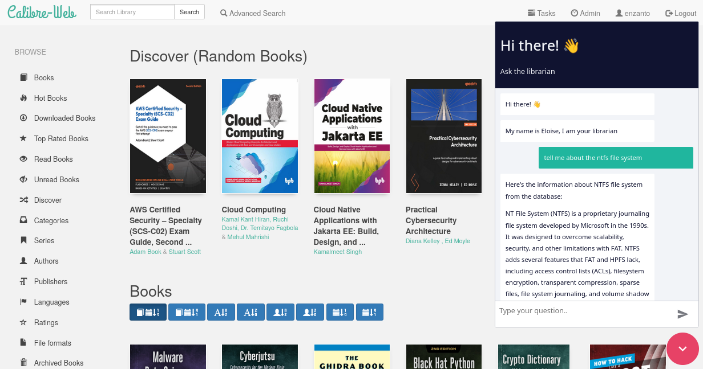

# Calibre Web Chat Integration

This project integrates Calibre Web with a live chat feature using N8N. It provides a real-time chat experience within the Calibre Web interface, allowing users to interact with support or automated systems directly within their ebook library.

## Features
- Real-time chat integration with Calibre Web
- Dynamic webhook URL configuration via environment variables
- Customizable Content Security Policy (CSP)
- Easy setup with Docker

## Installation

### Prerequisites:
- Docker: [Install Docker](https://www.docker.com/get-started)
- N8N: You need a running instance of n8n [N8N's website](https://n8n.io).

### Steps to run the project:

1. **Run the Docker container**:
   
    The container image is hosted at dockerhub: enzanto/calibre-web-chat

   docker run -e N8N_HOST="https://your.n8n.domain" -e N8N_WEBHOOK="https://your.n8n.domain/webhook/1234/chat" -p 8083:8083 enzanto/calibre-web-chat

2. **Access it at localhost:8083**:
    The website is available at http://localhost:8083.

## Acknowledgments
- **[Christer Steinfinsbø](https://github.com/chris2402)**: Thanks to Christer for brainstorming, bringing coffee, troubleshooting and helping me understand all we were doing.
- **[Cole Medin](https://www.youtube.com/@ColeMedinhttps://github.com/chris2402)**: Big thanks to Cole Medin for have great easy to follow N8N tutorials on youtube.
- **[Calibre Web](https://github.com/janeczku/calibre-web)**: Thanks to the developers of Calibre Web for the excellent open-source ebook management tool that powers this project.
- **[N8N](https://n8n.io)**: Special thanks to the team at N8N for providing an easy-to-use automation platform that makes integrating chat functionality seamless.
- **Docker**: For providing a containerization platform that allows easy deployment and sharing of this project.
- **Open Source Community**: Thank you to the open-source community for continuous support and contributions.
